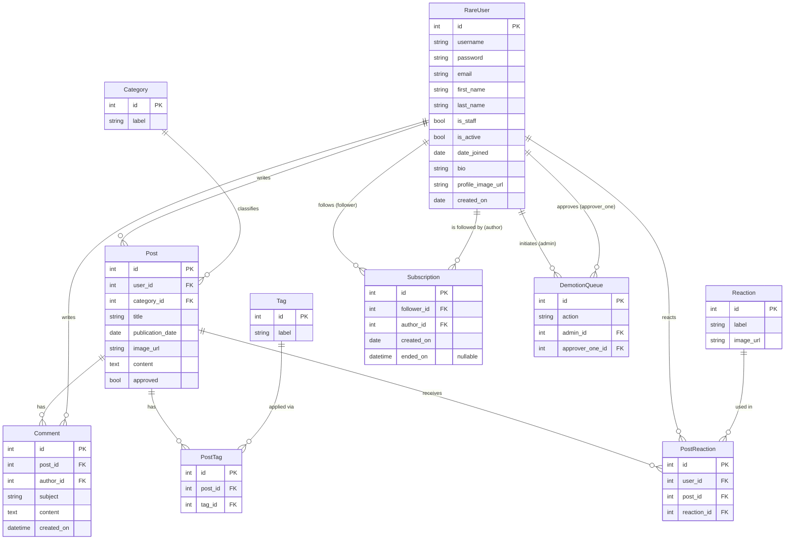

# Rare — Database Schema

## Notes

- `RareUser` extends Django's `AbstractUser` — the fields `username` through `date_joined` are inherited; `bio`, `profile_image_url`, and `created_on` are custom additions.
- `Post.approved` defaults to `false` for regular users; admin-authored posts are auto-approved by the API layer.
- `Subscription.ended_on` is nullable — a `NULL` value means the subscription is currently active; a timestamp means it was cancelled.
- `DemotionQueue` enforces `unique_together(action, admin, approver_one)` to prevent duplicate approval votes.
- `PostTag` and `PostReaction` are explicit join tables rather than Django `ManyToManyField` so the API can address them directly.
